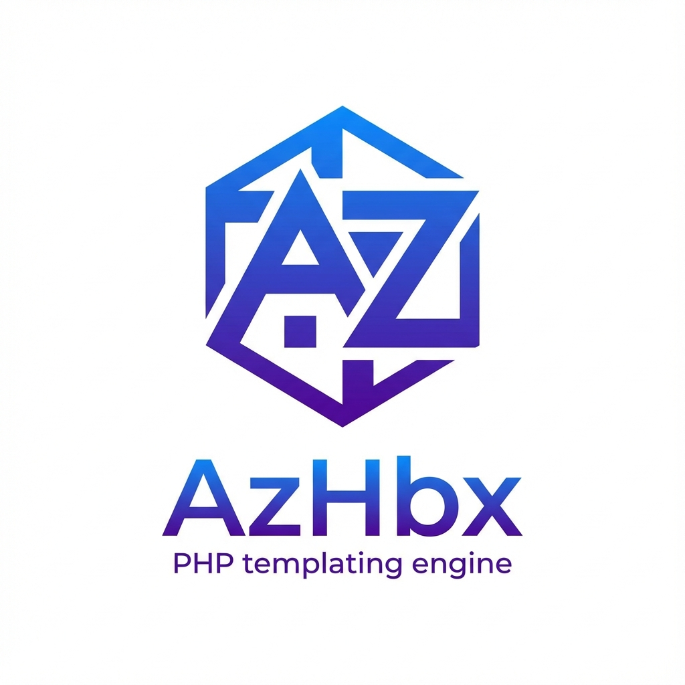

<div align="center">

# 🚀 AzHbx

**Next-Generation PHP Templating Engine**

[](https://php.net)
[](LICENSE)
[](https://github.com/AlizHarb/azhbx/actions)
[](https://github.com/AlizHarb/azhbx/actions)
[](https://packagist.org/packages/alizharb/azhbx)
[](https://github.com/AlizHarb/azhbx/stargazers)
[](https://github.com/sponsors/AlizHarb)

_Handlebars-inspired • Modern PHP • Production-Ready_

[Features](#-features) • [Installation](#-installation) • [Quick Start](#-quick-start) • [Documentation](#-documentation) • [Examples](#-examples)

</div>

---

## 🎯 Overview

<p align="center">
  
</p>

# AzHbx (AlizHarb Handlebars Extended)


[]()
is a powerful, modern PHP templating engine designed for PHP 8.3+. It combines the elegance of Handlebars syntax with cutting-edge PHP features like Property Hooks and Attributes, delivering exceptional performance and developer experience.

### Why AzHbx?

- **🔒 Secure by Default**: Auto-escaping prevents XSS attacks
- **⚡ Blazing Fast**: Compiles to native PHP with OpCache support
- **🎨 Theme System**: Built-in multi-theme support with fallback logic
- **🧩 Modular Architecture**: Organize templates by feature/package
- **🔌 Plugin System**: Extend functionality with PHP 8.3+ Attributes
- **📦 Zero Dependencies**: Works with or without Composer
- **🎯 Developer-Friendly**: Clean syntax, comprehensive docs, great DX

---

## ✨ Features

### Core Templating

- **Handlebars-Inspired Syntax**: Familiar `{{ }}` expressions
- **Nested Data Access**: Dot notation (`{{ user.profile.name }}`)
- **Control Structures**: `if`, `unless`, `each`, `with`
- **Layouts & Partials**: Template inheritance and reusable components
- **Custom Helpers**: Extend with your own logic
- **Whitespace Control**: Fine-tune output formatting

### Advanced Features

- **🎨 Theme Management**: Switch themes at runtime with smart fallbacks
- **📦 Module System**: Namespace templates by feature (`blog::post`)
- **🔌 Plugin Architecture**: Use PHP 8.3+ `#[Helper]` attributes
- **⚡ Async Support**: Compatible with PHP Fibers for non-blocking I/O
- **🔐 Security First**: XSS prevention with auto-escaping
- **💾 Smart Caching**: Automatic recompilation on file changes
- **🚀 Framework Adapters**: Native integration for **Laravel** and **Symfony**
- **🏎️ High Performance**: Compile-time optimizations make it faster than Twig and Blade
- **🛠️ Profiler & Debug Toolbar**: Real-time performance stats and hot reload during development.
- **⚙️ Error Code Catalog**: Standardized error codes for consistent error handling.
- **🔧 Quality Tools**: Integrated PHPStan and PHP-CS-Fixer for static analysis and code style.

---

## 📦 Installation

### Via Composer (Recommended)

```bash
composer require alizharb/azhbx
```

### Standalone (No Composer)

Download the source and include the autoloader:

```php
require 'path/to/azhbx/src/autoload.php';
```

---

## 🚀 Quick Start

```php
use AlizHarb\AzHbx\Engine;

// Initialize
$engine = new Engine([
    'views_path' => __DIR__ . '/views',
    'cache_path' => __DIR__ . '/cache',
]);

// Render
echo $engine->render('welcome', [
    'user' => [
        'name' => 'Alice',
        'role' => 'Admin'
    ]
]);
```

**Template** (`views/themes/default/welcome.hbx`):

```html
<h1>Welcome, {{ user.name }}!</h1>
<p>Role: {{ user.role }}</p>
```

---

## 📚 Documentation

### 🌐 Online Documentation

**Visit the live documentation**: [https://alizharb.github.io/azhbx/](https://alizharb.github.io/azhbx/)

Browse comprehensive guides and examples:

- **[Introduction](https://alizharb.github.io/azhbx/?page=introduction)**
- **[Installation & Configuration](https://alizharb.github.io/azhbx/?page=installation)**
- **[Basic Syntax](https://alizharb.github.io/azhbx/?page=basics)**
- **[Control Structures](https://alizharb.github.io/azhbx/?page=control-structures)**
- **[Layouts & Partials](https://alizharb.github.io/azhbx/?page=layouts-and-partials)**
- **[Custom Helpers](https://alizharb.github.io/azhbx/?page=helpers)**
- **[Plugins & Extensions](https://alizharb.github.io/azhbx/?page=plugins)**
- **[Themes & Modules](https://alizharb.github.io/azhbx/?page=themes-and-modules)**
- **[Advanced Topics](https://alizharb.github.io/azhbx/?page=advanced)**

### 📖 Local Documentation

You can also run the documentation website locally:

```bash
php -S localhost:8000 -t docs
```

Visit `http://localhost:8000` to browse the interactive docs.

---

## 💡 Examples

Explore real-world examples in the `examples/` directory:

```bash
php -S localhost:8001 -t examples
```

Visit `http://localhost:8001` to see:

- Basic rendering
- Control structures
- Layouts and partials
- Custom helpers
- Theme switching
- Module system
- Plugin architecture
- Async rendering with Fibers

---

## 🧩 Component System

AzHbx supports a powerful component system with Blade-like syntax:

```html
<!-- Inline Component -->
<az-Icon name="user" size="lg" />

<!-- Block Component -->
<az-Alert type="error">
  <strong>Error!</strong> Something went wrong.
</az-Alert>
```

Components are stored in `views/components/` (e.g., `views/components/alert.hbx`).

---

## ⚡ Directives

Directives are special helpers starting with `@` for common tasks:

- `{{ @csrf }}` - CSRF token input
- `{{ @method "PUT" }}` - HTTP method spoofing
- `{{# @auth }}...{{/ @auth }}` - Content for authenticated users
- `{{# @guest }}...{{/ @guest }}` - Content for guests
- `{{# @env "production" }}...{{/ @env }}` - Environment-specific content

---

## 🔌 Plugin System

Create powerful extensions using PHP 8.5+ Attributes:

```php
use AlizHarb\AzHbx\Contracts\PluginInterface;
use AlizHarb\AzHbx\Attributes\Helper;
use AlizHarb\AzHbx\Attributes\Directive;

class MyPlugin implements PluginInterface
{
    public function register(Engine $engine): void {}

    #[Helper('uppercase')]
    public function uppercase(string $text): string
    {
        return strtoupper($text);
    }

    #[Directive('myDirective')]
    public function myDirective(array $context): string
    {
        return "Custom Directive";
    }
}
```

---

## 🎨 Theme System

Switch themes dynamically:

```php
$engine->setTheme('dark');
echo $engine->render('home', $data);
```

**Directory Structure:**

```
views/
├── themes/
│   ├── default/
│   │   └── home.hbx
│   └── dark/
│       └── home.hbx  ← Overrides default
└── partials/
    └── header.hbx
```

---

## 🧪 Testing

Run the test suite:

```bash
composer test
```

Or with coverage:

```bash
composer test:coverage
```

---

## 🤝 Contributing

We welcome contributions! Please see [CONTRIBUTING.md](CONTRIBUTING.md) for details.

### Development Setup

```bash
git clone https://github.com/AlizHarb/azhbx.git
cd azhbx
composer install
composer test
```

---

## 📋 Requirements

- **PHP**: 8.3 or higher
- **Extensions**: `mbstring`

---

## 📄 License

AzHbx is open-source software licensed under the [MIT License](LICENSE).

---

## 🙏 Acknowledgments

Inspired by [Handlebars.js](https://handlebarsjs.com/) and modern PHP best practices.

---

<div align="center">

**Built with ❤️ by [Ali Harb](https://github.com/AlizHarb)**

[⬆ Back to Top](#-azhbx)

</div>
